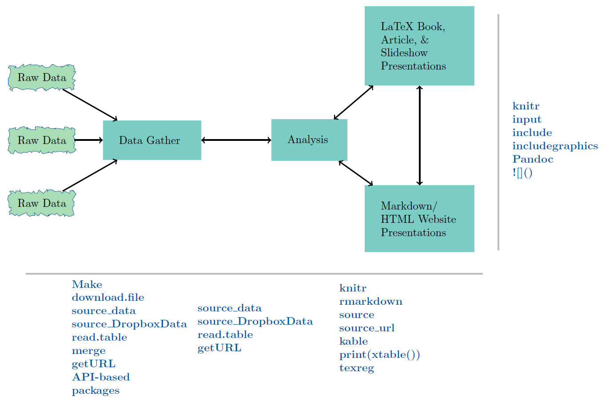
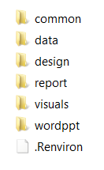

--
title: "Influences of reproducible reporting on work flow"
author: "Richard Layton"
date: 2015-07-04
output:
  md_document:
    variant: markdown_github
bibliography: ../common/RepResRef.bib
---
    
    
```{r echo=FALSE}
# initialize knitr
library(knitr) 
opts_knit$set(root.dir = "../")
opts_chunk$set(include=TRUE, echo=FALSE, eval=TRUE)
```

```{r}
# setup knitr, pandoc, and table/figure auto-number functions
source("common/RSetUpForRmdFiles.R")
source("common/myFunctions.R")
```


# Influences of reproducible reporting on work flow

Richard Layton   
2015-07-04  


## Reproducible reports

<!--

--> 


The aspect of reproducible research that has most influenced my own work is the  _reproducible (or dynamic) report_, where a _report_ is a research product such as a journal article, a conference talk, or a progress report for the research team.  In a reproducible report, narrative and code are written in explicitly linked scripts. Changes made in the narrative or code in one part of the work cascade through the other parts, generating a fully updated version of the report.   
 
Three books have significantly influenced how I use R reproducibly: *Dynamic Documents with R and knitr* [@Xie2014], *Reproducible Research with R and RStudio* [@Gandrud2014], and *Implementing Reproducible Research* [@Stodden2014], all in the CRC Press R Series.

In general, Xie focuses on the dynamic document, Gandrud on the reproducible project, and Stodden, Leisch, and Peng (eds.) on all of the above (tools, practices, guidelines, and platforms) including larger issues such as intellectual property, open science practice, large-scale projects, and reproducible publishing. Taken together, the books provide sufficient breadth to address most beginners' needs and sufficient depth to afford new insights to experienced practitioners. 


## Dynamic documents with R and knitr

Each book acknowledges the roughly 25-year history of reproducible research and the debt the community owes to innovators like Don Knuth, Jon Claerbot, and others. Still, I credit two recently developed software environments---Yihui Xie's [*knitr*](http://yihui.name/knitr/) package and the [*RStudio*](http://www.rstudio.com/) IDE---with making dynamic documents easy to create and maintain. ([Jeff Leek](http://simplystatistics.org/2014/09/04/why-the-three-biggest-positive-contributions-to-reproducible-research-are-the-ipython-notebook-knitr-and-galaxy/) adds iPython, rmarkdown, and Galaxy to this list.)

Xie's book and [website](http://yihui.name/knitr/) are the references of first resort for learning the _knitr_ package. Explanations are occasionally terse, reminiscent of the CRAN package format where it sometimes seems you have to already know the answer to understand the explanation. But with the help of the _knitr_ Q\&A, [stack**overflow**](https://stackoverflow.com/questions/tagged/r), and [r-bloggers](http://www.r-bloggers.com/), I've usually been able to get the software to do my bidding.  

The main drawback of the book is that Xie's recommended practices are best suited to smaller reproducible projects such as student work or a single research article, rather than larger, multi-year, multi-deliverable projects. To give a specific example, the _knitr_ default working directory is the directory in which the report file resides. This default may not be a problem for smaller projects but I have found it unsuitable for larger projects. 

Happily, Xie has provided a _knitr_ option to specify the working directory. My reports usually reside in a report directory one level down from the main directory. Including the following code chunk in the report file matches the working directory used by _knitr_ to the working directory used by the _RStudio project_. Note the relative path---I agree with Yihui that relative paths are a Good Thing.  
  
```{r echo=TRUE, eval=FALSE}
library(knitr) 
opts_knit$set(root.dir = "../") 
```

I'm happy to report that Xie has just published a second edition of the book with new material on using R Markdown and a number of other updates. Details can be found at {GITHUB OR PUBLISHER LINK}. 


## Reproducible research with R and RStudio

Of course, I'm not the only one to find that managing working directories and establishing (and sticking to) a file-naming convention are substantive issues. Jenny Bryan offers some great insights on [organizing files](https://github.com/jennybc/organization-and-naming/tree/master/organization) and on managing the [working directory madness](getURL) {NEED THE URL}. This is also one of the strengths of Gandrud's book.

Gandrud shows us the dynamic report in its natural habitat: the computational project. He makes good arguments for planning for reproducibility from the beginning of a project and offers field-tested advice for doing so. Gandrud identifies three main categories of work in computational research---data, analysis, and presentation. He recommends that a project main directory contain a sub-directory for each of the three categories. 

He describes how to use _knitr_ and _RStudio_ to perform commonly encountered tasks, for example, how to reproducibly obtain and manipulate data or how to get started with R Markdown (Rmd files) or LaTeX (Rnw files) for reproducible reporting. Gandrud covers task work in each area (data, analysis, and presentation) and how those tasks are interconnected. The book is written with a level of detail suitable for reproducible research beginners. 


The figure, borrowed from Gandrud's GitHub [repository](https://github.com/christophergandrud/Rep-Res-Book) for the [2nd edition](https://www.crcpress.com/product/isbn/9781498715379) of his book, shows the connections between the three main elements and the family of scripting commands used for each connection. 

<!--

-->



Only one minor complaint. The enthusiasm with which Gandrud introduces _Make_ made me eager to give it a try, but I never quite figured it out. The barrier to understanding is partly my unfamiliarity with the _make_ environment and partly that the topic is developed at a somewhat higher level than other topics in the book. This might be a case of unstated  assumptions obvious to the author that are not obvious to the reader---always a hazard when the expert writes for the novice. 

Nevertheless, this is a minor quibble. Gandrud's work has had a significant and lasting effect on how I think about my work flow and how I implement my work flow.  I highly recommend the book and I look forward to adding the second edition to my library. 


## Implementing reproducible research

In my opinion, everyone using R for reproducible research will want to read Xie and Gandrud cover-to-cover and more than once. (Again, both books are now available in 2/e.) In contrast, turning to the collection edited by Stodden, Leisch, and Peng, some chapters were more engaging than others. All are well written (and edited) but like conference proceedings, readers will probably be drawn to those chapters best aligned with their personal interests. 

Nevertheless, because the book provides a broad view of the entire reproducible research landscape (circa 2014), every practitioner should find practical suggestions to apply in their own work as well as thought-provoking propositions on the future of the field. 

The book is divided into three major parts: [list the three parts here]. 
In part 1, ...
In part 2, ...
In part 3, ...


discussions of software itself become dated quickly
but the issues will be with us longer

parts that spoke to me
the chapter on the large-scale project and how to manage
that some of the problems (dealing with Word) have been solved since publication
in Xie's chapter I learned more useful stuff about knitr
in Stodden's chapter I learned about IP


## Influences

These authors and editors describe an environment for reproducible research in which every reader can find some elements to adopt to improve their work flow. A full-scale overhaul of one's research practice is not required. 

I have encountered a number of schemes for directory and file organization. Jenny Bryan, for example, has posted some good advice from her [talk](https://github.com/jennybc/rr-organization1/tree/master/slides/organization-slides) at the Reproducible Science Workshop.

In my current work flow, I've modified Gandrud's directory structure to suit my own needs, expanding his three basic categories---data, analysis, and presentation---to the directory structure shown below.

<!--

-->



*Brief descriptions of each directory*

*/common* &ensp; For document elements re-used from project to project, e.g., business logo, LaTeX preambles, bibliography files,  templates for rendering R Markdown to MSWord, etc. 

*/data* &ensp; Excel data spreadsheets received from collaborators; R scripts that gather and manipulate data and write the  structured data frames to file in CSV format. The R scripts document the file names used and the data manipulation explicitly, enabling me or someone else to reproduce or verify the work.  I usually make these R scripts self-contained  so that I can run them independently of any other work in the project. 

Some data scientists recommend that original or raw data have it own directory top help keep it unaltered in any way. Others recommend that the R scripts for tidying data also have their own directory. 

<br> 

*/design* &ensp; R scripts that read the prepared CSV data files, create graphs and tables, and write them to the */visuals* directory in desired graphic formats. These R scripts are also self-contained so I can execute them independently while I'm designing and revising a graph. I prefer to call this directory "design" because my primary work is in creating graphs; others may prefer "analysis". "

<br>  

*/reports* &ensp; Scripts in `Rnw` or `Rmd` markup to produce the final report document. If I'm the sole author for a project, I use `Rnw` markup because LaTeX supports advanced document design and because some journals have ready-made LaTeX styles. I use `Rmd` markup when I have collaborators who use MSWord exclusively. 

In either case, the report script executes each independent data script and design script by name and includes the resulting tables and graphs in the report with accompanying narratives. This is the master script that invokes all the other scripts required to render a particular report in the desired format, e.g., PDF, HTML, or MSWord. 

<br> 

Placing my main script for the report in a */reports* directory is contrary to Yihui Xie's advice in [@Xie2014]; he prefers the main report script to be in the working directory. I prefer the arrangement shown here. However, I agree with Xie's advice to use relative directory paths to support portability and reproducibility.

Lastly, I should note that in this work flow, every script is executed every time I update a report. Not a problem for smaller data sets but this approach is computationally expensive for larger data sets. Gandrud (and others) recommend *make* to save time. 

*/wordppt* &ensp; I regularly work with colleagues do not work reproducibly---who regularly do analysis in Excel, reporting in Word, and presenting in PowerPoint.  Materials they send me are saved in this directory. If any of their work affects my reproducible work, I make the necessary updates and revisions to my scripts, re-run the main report, and send it to my collaborators. 

<br>  

If I am in charge of the final report, it will be fully reproducible. If another member of the team is in charge of the final report and they are not using reproducible practices, they will copy and paste elements from my work to import it to the final report. Thus some non-reproducible steps are introduced into the work flow. 

Hoefling and Rossinni, in [@Stodden2014, Ch. 8], have some perceptive insights into the problems of collaborating on large-scale reproducible projects. Some of the future improvements they wanted have been addressed since the book was published, e.g., if one uses RMarkdown to render a report to MSWord, we now have support for tables and MSWord style assignments for headers, footers, section headings, etc. Tables are now supported using the *kable()* function in *knitr* or using RMarkdown to MSWord.  

## Final thoughts

Applying two basic principles for reproducible research---explicitly linking computing, results, and narrative, and organizing for reproducibility from the beginning of a project---has improved the  productivity of my computational work and my contributions to collaborative research. 

In retrospect, it seems astonishing that work flows like I've described here have only recently begun to be taught to students of science, engineering, and mathematics. As Millman and Perez put it, 

> Yet, for all its importance, computing receives perfunctory attention in the training of new scientists and in the conduct of everyday research. It is treated as an inconsequential task that students and researchers learn "on the go" with little consideration for ensuring computational results are trustworthy, comprehensible, and ultimately a secure foundation for reproducible outcomes. Software and data are stored with poor organization, little documentation, and few tests. A haphazard patchwork of software tools is used with limited attention paid to capturing the complex workflows that emerge. The evolution of code is not tracked over time, making it difficult to understand what iteration of the code was used to obtain any specific result. Finally, many of the software packages used by scientists in research are proprietary and closed source, preventing complete understanding and control of the final scientific result [@Stodden2014, Ch. 6]. 

Anyone working to make their research reproducible will find abundant  advice, practical suggestions, how-to examples, and ideas and issues to ponder in all three books. I have read and re-read them a number of times and I look forward to Xie's and Gandrud's second editions.  

## References

<!--last line-->
